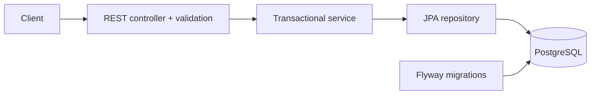

# Expense Tracker API

A small Java REST API for recording expenses in EUR. Built as the first project in a backend engineering portfolio, with PostgreSQL persistence, reproducible Docker setup, and integration tests against a real database.

## What this demonstrates

- REST semantics: `201` + `Location`, `204`, `400`, and `404`.
- Java 21 records for request and response contracts, independent of persistence entities.
- Input validation and consistent RFC 9457 Problem Details errors.
- Decimal amounts using `BigDecimal` and PostgreSQL `NUMERIC(12,2)`.
- Database migrations with Flyway and schema validation with Hibernate.
- Filtering, bounded pagination, and deterministic ordering.
- Integration tests with HTTP requests and Testcontainers PostgreSQL.
- A multi-stage Docker image running as a non-root user, and GitHub Actions CI.

## Run with Docker

Prerequisite: Docker with the Compose plugin. No local Java or Maven installation is needed for this option.

```sh
docker compose up --build -d --wait
curl http://localhost:8080/actuator/health
```

The health response includes `"status":"UP"`. The first build downloads dependencies and images.

Create an expense:

```sh
curl -i http://localhost:8080/api/v1/expenses \
  -H 'Content-Type: application/json' \
  -d '{"description":"Lunch","amount":12.30,"category":"FOOD","incurredOn":"2026-09-01"}'
```

The response includes a generated `id`, `currency: "EUR"`, and a `Location` header. Use that ID to read, replace, or delete the expense.

```sh
curl 'http://localhost:8080/api/v1/expenses?category=FOOD&from=2026-09-01&to=2026-09-30&page=0&size=20'
```

Stop the application, keeping data:

```sh
docker compose down
```

For an intentional clean reset, `docker compose down -v` also deletes this project's database volume and all stored expenses.

## Run and test locally

Prerequisites: JDK 21 and Docker. Maven is provided by the committed wrapper (`mvnw.cmd` on Windows).

```sh
./mvnw verify
```

Tests start and clean up their own isolated PostgreSQL container. They do not use the development database, require fixed database ports, or silently skip when Docker is unavailable.

To run the API from an IDE or Maven:

```sh
docker compose up -d db --wait
./mvnw spring-boot:run
```

Stop the Compose `api` service first if it already occupies port 8080. For a different database port, set `DB_PORT` for Compose and update `DB_URL` for the local JVM.

## API contract

| Method | Path | Success | Behavior |
| --- | --- | --- | --- |
| POST | `/api/v1/expenses` | 201 | Create an expense; returns body and Location |
| GET | `/api/v1/expenses/{id}` | 200 | Read one expense |
| GET | `/api/v1/expenses` | 200 | List expenses with optional filters |
| PUT | `/api/v1/expenses/{id}` | 200 | Replace all editable fields of an existing expense |
| DELETE | `/api/v1/expenses/{id}` | 204 | Delete an existing expense |
| GET | `/actuator/health` | 200 | Check application and database health |

### Request body

| Field | Rules |
| --- | --- |
| `description` | Required, nonblank, at most 120 characters; outer whitespace is stripped |
| `amount` | Required, 0.01–9,999,999,999.99, at most two decimal places |
| `category` | `FOOD`, `TRANSPORT`, `HOUSING`, `ENTERTAINMENT`, `HEALTH`, or `OTHER` |
| `incurredOn` | Required ISO date (`YYYY-MM-DD`); future dates are accepted |

Amounts always represent EUR; currency is a read-only response field. There is no currency conversion.

### List parameters

`category`, `from`, and `to` are optional and combined with AND. Both date boundaries are inclusive. A reversed date range returns 400.

`page` is zero-based and defaults to 0. `size` defaults to 20 and must be between 1 and 100. Results are ordered by expense date descending and UUID ascending as a tie-breaker. The response has `content`, `page`, `size`, `totalElements`, and `totalPages` fields. Out-of-range pages return an empty `content` array.

Validation failures return 400. Missing resources return 404, including repeated deletes. Malformed JSON, invalid enum values, invalid IDs, and invalid query parameters return 400 using `application/problem+json`.

Example field validation error:

```json
{
  "type": "about:blank",
  "title": "Bad Request",
  "status": 400,
  "detail": "One or more fields are invalid",
  "instance": "/api/v1/expenses",
  "errors": { "amount": "must be greater than or equal to 0.01" }
}
```

Ready-to-run requests are also in [requests.http](requests.http).

## Design decisions and scope



The code is organized around one feature, with a controller, service, repository, and separate DTOs. Writes use service-level transactions. Flyway owns the schema; Hibernate validates it on startup instead of modifying it. Open Session in View is disabled, and responses are mapped inside the service transaction.

This is a single-user local demonstration. It has no authentication or user isolation and must not be exposed as a public data service as-is. Compose binds its ports to loopback and uses clearly local-only database credentials. All examples are fictional and the project contains no employer code or data.

The scope deliberately excludes payment processing, messaging, idempotency keys, audit trails, and concurrent-update protection. Sequential updates work; concurrent changes are not protected from lost updates. Those are separate portfolio topics. Offset pagination is sufficient for this small dataset; inserts between requests can shift pages.

## Configuration

| Variable | Default | Purpose |
| --- | --- | --- |
| `DB_URL` | `jdbc:postgresql://localhost:5433/expenses` | JDBC URL for a local JVM; Compose sets the container URL |
| `DB_USERNAME` | `expenses` | Database user; Compose fixes its demo user to `expenses` |
| `DB_PASSWORD` | `expenses-local` | Local demo password; can be overridden |
| `DB_PORT` | `5433` | Published PostgreSQL port in Compose |
| `API_PORT` | `8080` | Published API port in Compose |

The `.env` file is ignored by Git. Changing `DB_PASSWORD` does not change the password of an already initialized PostgreSQL volume.

## Verification

`./mvnw verify` exercises creation, reads, persisted updates, deletion, missing resources, invalid bodies and amounts, invalid queries, inclusive date filtering, pagination, and health checks. CI runs the same verification and builds the Docker image. Docker image builds omit tests because Testcontainers requires access to a Docker daemon; run verification before building locally.
